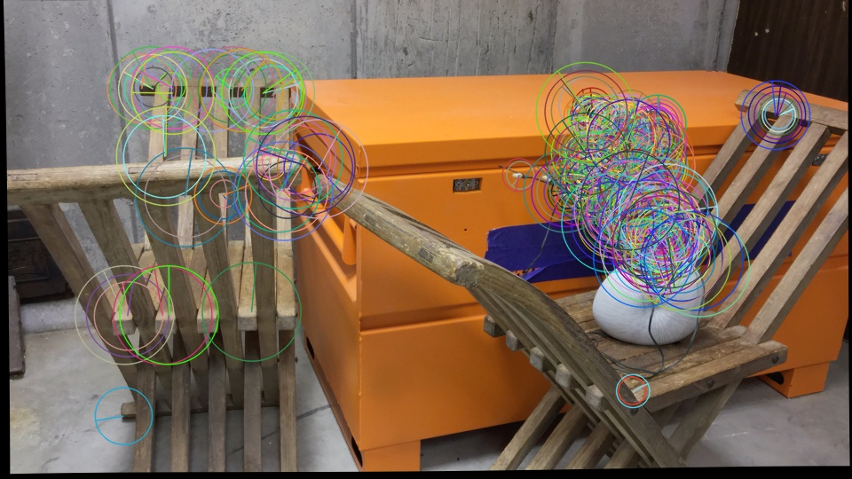
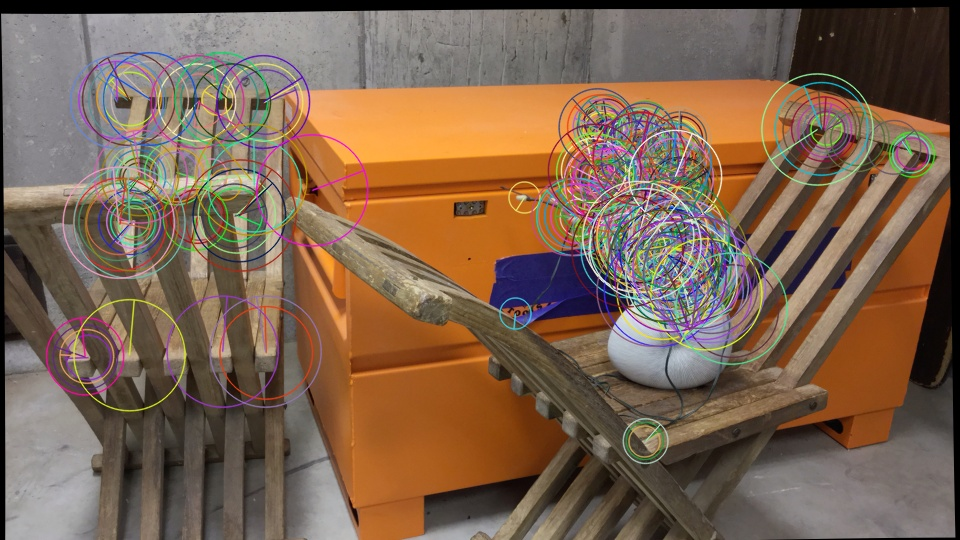
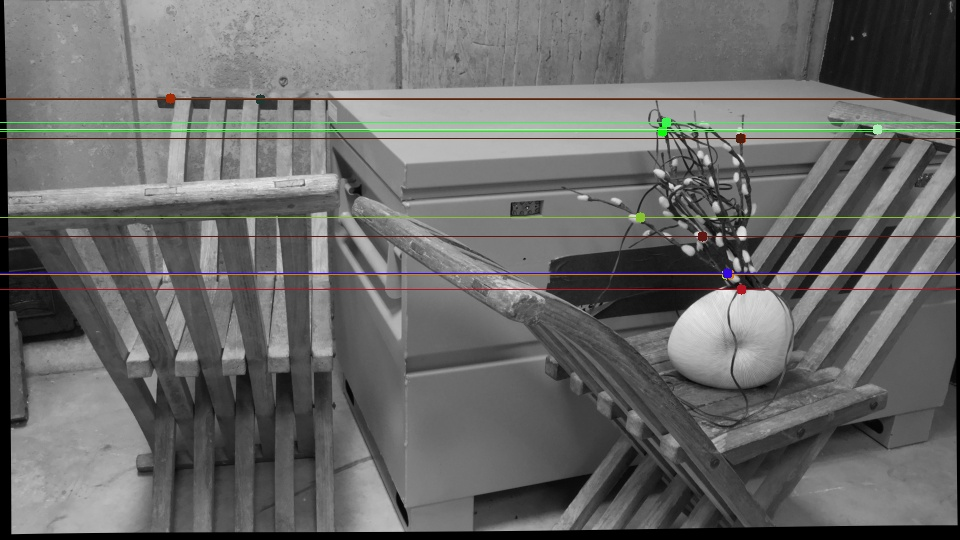
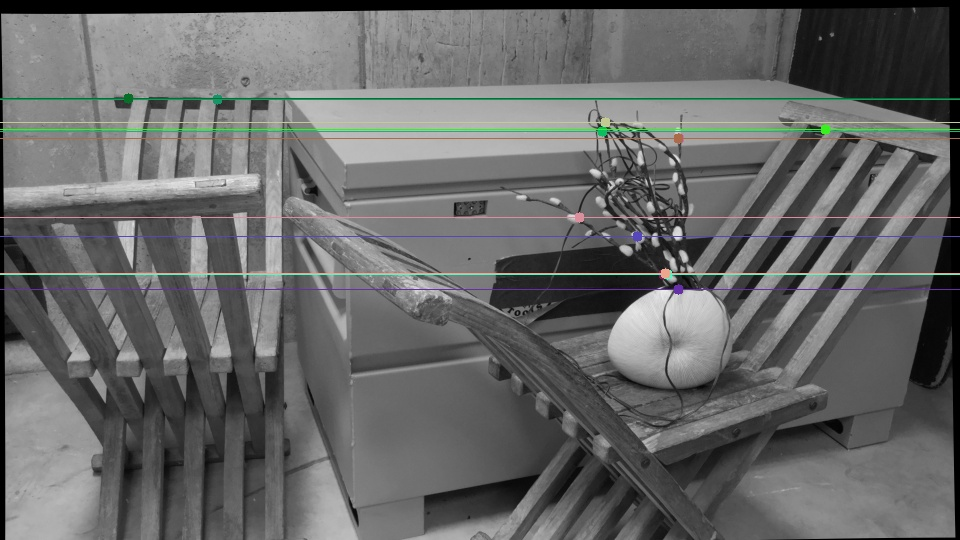
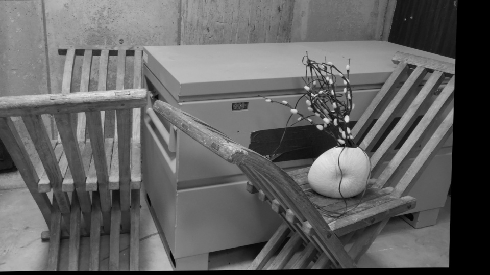
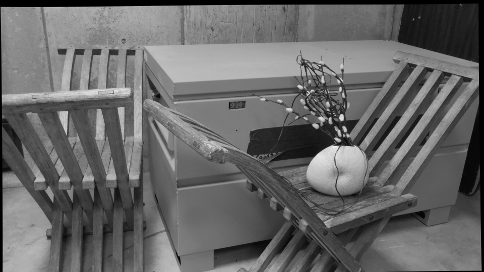
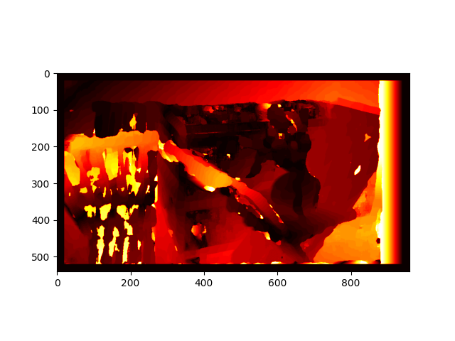
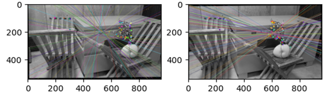

<!-- # Download the files to a location of choice
## Unzip it and you will find
__
|-- hemanth1.pdf (PDF report)
|-- curule.py (python file for first dataset)
|-- octagon.py (python file for second dataset)
|-- pendulum.py (python file for third dataset)
|-- This README.md file

## Open the .py files one after the another in a IDE of choice, preferrably VSCode
- Since the dataset files aren't a part of the ZIP file, in each python file change the path for the left image as img_0 in cv.imread
- Similarly for the right image, change the path for the right image as img_1 in cv.imread
### Run the files one after another by hitting the run button on the IDE and the program will run
#### Note when running
- As and when image outputs show on the screen, press any key to go to the next image output
- The calculation for disparity takes anywhere between 3 - 6 minutes depending upon the computer specifications, please wait until then -->
# Stereovision Depth Mapping
Taking two images from a sequence, performing epipolar geometry on it. Then apply stereovision techniques to estimate the depth in the images. <br>
This serves as an entry point for various 3-D depth estimation and scene reconstruction techniques. <br>

Keypoints Image A         |  Keypoints Image B
:-------------------------:|:-------------------------:
  |  

## Pipeline to perform Stereovision Depth Mapping
### Part 1 - Calibration of the camera
1. Read two images separately and convert to grayscale for easier processing
2. Rescale images to fit in screen
3. Use ORB detector to detect keypoints in both images. Create an orb object
4. Detect and compute key points and descriptors for both images
5. Match features on both images. Create a Brute force matcher and use k-nearest neighbours
method to match points on both images
6. Now from the matched points we only choose good matches, ones which are distinct enough
7. Now we need to calculate the pixel coordinates of the good matching points since the
matching points are in the form of DObjects
8. From the resulting coordinate points choose only the first 8 points for each image as we
need only 8 points to calculate our Fundamental matrix
9. Arrange these 8 points from each image into an array A and take its SVD
10. The last column of the V matrix from the SVD is the needed Fundamental matrix. We
extract and reshape into an 3 by 3 matrix and therefore we get the Fundamental Matrix
11. Once we have the fundamental matrix we need to calculate the Essential Matrix. For that we
need the intrinsic camera parameters, this is already provided to us
12. The essential matrix is the matrix multiplication of the three matrices in the particular order
Transpose of intrinsic matrix * Fundamental matrix * Intrinsic matrix
13. Thus we obtain the Essential matrix for the images
14. Now we need to decompose the Essential matrix into corresponding pairs of translation and
rotation matrices. We will get four such pairs
15. First we perform the SVD of Essential matrix. Define a new matrix W as follows
```
[0, -1, 0]
[1, 0, 0]
[0, 0, 1]
```
16. We get the following four pairs of translation and rotation matrices
```
C1 = U[:, 2]
R1 = U * W * V transpose (U and V are from the SVD of essential matrix)
C2 = - U[:, 2]
R2 = U * W * V transpose
C3 = U[:, 2]
R3 = U * W transpose * V transpose
C4 = - U[:, 2]
R4 = U * W transpose * V transpose
```

Keypoints Image A         |  Keypoints Image B
:-------------------------:|:-------------------------:
  |  


Epilines Image A         |  Epilines Image B
:-------------------------:|:-------------------------:
  |  


### Part 2 – Rectification
1. Using the cv.stereoRectifyUncalibrated function to get the homography matrices for
both images
The homography matrices are
```
H1 = [[-6.79073699e-01 -2.55442303e-03 2.50387638e+01]
      [ 0.00000000e+00 -7.07110000e-01 0.00000000e+00]
      [ 0.00000000e+00 0.00000000e+00 -7.07110000e-01]]

H2 = [[1. 0. 0.]
      [0. 1. 0.]
      [0. 0. 1.]]
```
2. Warp the perspective of both the images so that the epilines are horizontal in the images

Rectified Image A         |  Rectified Image B
:-------------------------:|:-------------------------:
  |  

### Part 3 – Correspondence and Depth Computation
1. Convert the images into arrays
2. If shape isn’t same raise an error to handle the exception
3. Create a zeros of disparity map
4. Since disparity calculation takes time, tqdm is used to monitor progress
5. Iterate over each pixel to calculate disparity
6. Choose a small block in left image
7. Compare it with a block from the right image
8. Get a search range for right image
9. Iterate through the range for right image
10. Calculate the disparity and depth

<p align="center">
    

These outputs are for just one dataset. Outputs from other datasets are available in the respective folders.

## Usage
* Clone the repo to your local machine
```
git clone https://github.com/HemanthJoseph/Stereovison-Depth-Mapping.git
```
* Run the python file of choice
```
python curule.py
```

## Dependencies and libraries
1. Python 3.9.12
2. OpenCV '4.7.0'
3. Numpy '1.24.2'

## Note when running
- As and when image outputs show on the screen, press any key to go to the next image output
- The calculation for disparity takes anywhere between 3 - 6 minutes depending upon the computer specifications, please wait until then for the computation

## Issues faced
I faced an issue where my epipole was falling inside my image and I wasn’t getting the results I had expected. After going through eash line I found out the problem was with the bruteforce matcher method before getting the matching points. I was using the 
```cv.NORM_HAMMING``` for matching which gave rise this problem.

<p align="center">
     <br>

```
bf = cv.BFMatcher_create(cv.NORM_HAMMING)
```
I solved this by using a simple brute force matcher.
```
bf = cv.BFMatcher()
```